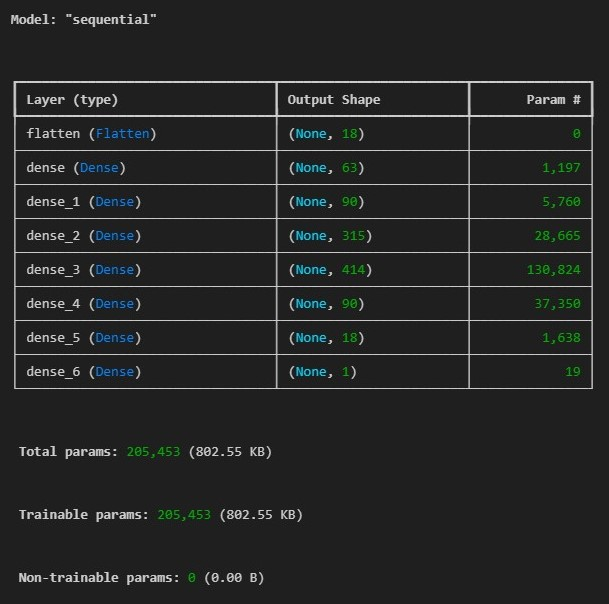
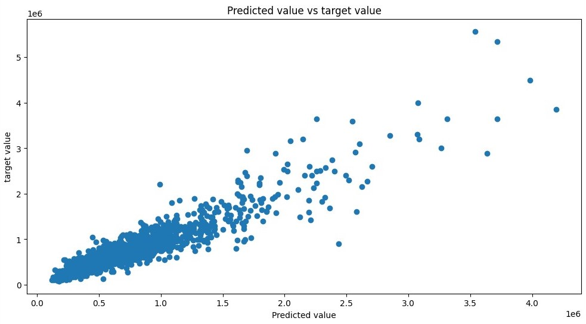

Using a dataset of house prices from (https://www.kaggle.com/datasets/harlfoxem/housesalesprediction)
We aim to build an artificial neural network (ANN) optimized with Keras-Tuner.

About the data set: 

Number of rows: 21613
Number of columns: 21

We use 18 columns as features (inputs), 1 as target, and drop 2

## Model results

Structure:

Hyperparameters:

num_layers: 6
units_0: 63
activation: leaky_relu
dropout: False
lr: 0.00110654178783952

Metrics: 

MAE:  71602.69808292852
MAPE:  0.1280146931732677

